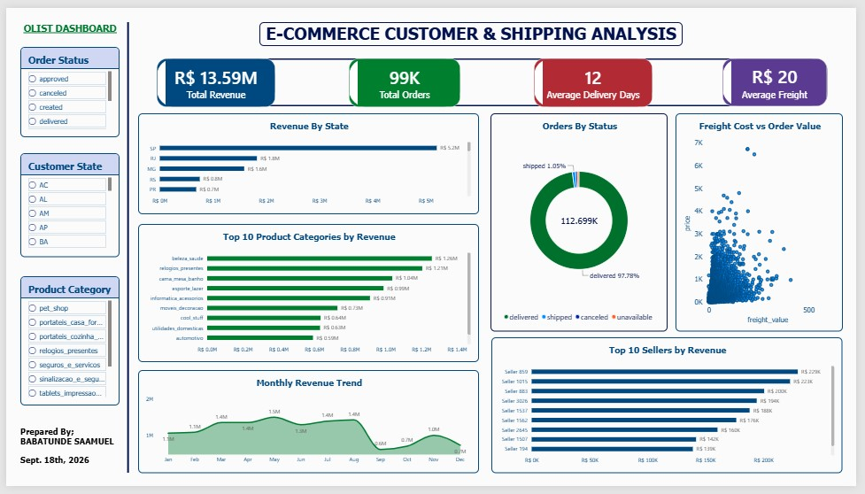

# E-commerce Customer & Shipping Performance Analysis

## Project Overview

This project analyses e-commerce customer, order, seller, product and shipping data to understand revenue performance, order status, delivery performance and shipping-related patterns.

The project follows an end-to-end data analytics workflow:

**Data Cleaning → Data Transformation → Data Modelling → DAX Analysis → Visualisation → Insights → Recommendations**

## Business Problem

E-commerce businesses need reliable information about sales and delivery performance to monitor operations, understand customer demand and identify areas for improvement.

This project uses the Olist Brazilian e-commerce dataset to analyse customer orders and shipping performance and communicate the results through an interactive Power BI dashboard.

## Project Objectives

The dashboard was designed to answer questions such as:

- Which customer states generate the most revenue?
- What is the distribution of orders by status?
- How does freight value relate to product/order value?
- Which product categories generate the most revenue?
- How does revenue change over the months?
- Which sellers generate the highest revenue?
- What are the key delivery and freight KPIs?

## Dataset

The project uses the real Olist Brazilian e-commerce dataset, which contains multiple related tables covering areas such as customers, orders, products, sellers, payments, reviews and delivery dates.

The source tables were prepared and combined for analysis using Power Query before being loaded into Power BI.

## Data Cleaning & Preparation

Key preparation activities included:

- Reviewing source tables and column structures
- Checking and correcting data types
- Reviewing missing values, particularly delivery-date fields
- Standardising relevant fields
- Merging related tables
- Creating delivery-related analytical fields
- Validating the resulting analytical table
- Preparing the model for Power BI

## Power BI Data Model

The report uses an analytical model containing entities including:

- Orders
- Products
- Sellers
- Customers / customer-state information
- Date dimension

The model supports analysis across customer location, order status, product category, seller and time.

## Key KPIs

The final dashboard displays:

| KPI | Dashboard Value |
|---|---:|
| Total Revenue | R$ 13.59M |
| Total Orders | 99K |
| Average Delivery Days | 12 |
| Average Freight | R$ 20 |

*Values above are the rounded values displayed on the final dashboard.*

## Dashboard



The dashboard includes:

- Revenue by State
- Orders by Status
- Freight Cost vs Order/Product Value
- Top 10 Product Categories by Revenue
- Monthly Revenue Trend
- Top 10 Sellers by Revenue
- Order Status slicer
- Customer State slicer
- Product Category slicer

## Key Findings

### 1. Revenue is highly concentrated in São Paulo

São Paulo generated approximately **R$5.2M**, making it the strongest revenue-generating state shown in the dashboard. This represents roughly **38% of the R$13.59M total revenue** displayed.

### 2. Most orders were delivered

The order-status visual shows **97.78% of orders as delivered**, while **1.05% were shipped**. The remaining orders were distributed across cancelled, created and unavailable statuses.

This indicates that completed deliveries represent the overwhelming majority of orders in the analysed data.

### 3. May recorded the highest monthly revenue

The monthly revenue trend shows May at approximately **R$1.5M**, the highest monthly value displayed. September was among the lowest points at approximately **R$0.6M**.

### 4. Beauty & Health was the leading product category

The `beleza_saude` category generated approximately **R$1.26M**, followed by `relogios_presentes` at approximately **R$1.21M**.

### 5. Seller revenue is concentrated among the top sellers

The Top 10 Sellers visual shows a relatively small group of sellers generating the highest individual seller revenues, with the leading seller contributing approximately **R$229K**.

### 6. Freight and product value show strong clustering at lower values

The scatter plot shows that most observations are concentrated at lower product/order values and lower freight values. The visual does not suggest a simple, strong linear relationship across the entire dataset; further statistical analysis would be required to quantify the relationship.

## Recommendations

Based on the dashboard findings:

1. **Monitor state-level performance**  
   Continue tracking revenue by state and investigate the factors contributing to São Paulo's strong performance.

2. **Track delivery KPIs regularly**  
   Use average delivery days and order-status distribution as operational KPIs.

3. **Investigate low-revenue periods**  
   Examine the causes of weaker months, particularly the sharp decline visible around September.

4. **Support high-performing categories**  
   Monitor inventory, marketing and customer demand for leading categories such as Beauty & Health and Watches & Gifts.

5. **Monitor seller performance**  
   Track high-performing sellers and investigate whether delivery performance, product mix or order volume contributes to their results.

6. **Review freight efficiency**  
   Analyse freight cost relative to order/product value to identify potentially inefficient shipping patterns.

## Tools Used

- **Microsoft Excel** — initial data handling and analysis
- **Power Query** — data cleaning and transformation
- **Power BI** — modelling, visualisation and dashboard development
- **DAX** — KPI and analytical measures

## Skills Demonstrated

- Data cleaning
- Data transformation
- Data modelling
- Power Query
- DAX
- KPI development
- Data visualisation
- Dashboard design
- Business analysis
- Data storytelling
- Insight generation
- Business recommendations

## Repository Structure

```text
olist-ecommerce-customer-shipping-analysis/
│
├── Dataset/
├── Excel/
├── Power_Query/
├── PowerBI/
│   └── Olist_Dashboard.pbix
├── DAX/
├── Dashboard/
│   └── final-dashboard.jpg
├── Documentation/
└── README.md
```

## Author

**Babatunde Samuel**

Junior Data Analyst

**Skills:** Excel | Power Query | Power BI | DAX | SQL
